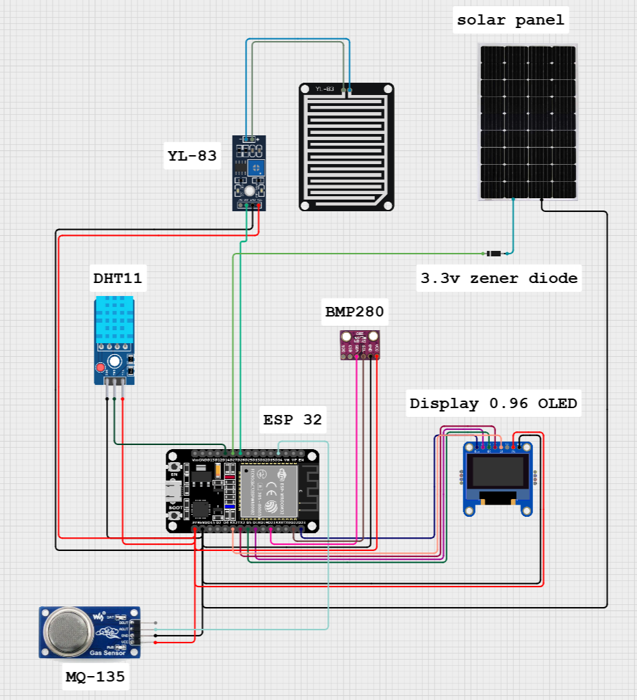

# Smart Weather Monitoring System

A comprehensive IoT-based weather monitoring system that provides real-time environmental data collection, visualization, and storage using ESP32 and various sensors.

## Features

- Real-time weather monitoring dashboard
- Historical data analysis and visualization
- Mobile-responsive web interface
- Data export functionality (CSV)
- Comprehensive sensor suite:
  - Temperature & Humidity (DHT11)
  - Atmospheric Pressure (BMP280)
  - Air Quality (MQ-135)
  - Rain Detection (YL-83 FC-37)
  - Solar Power System monitoring

## System Architecture



*System architecture diagram showing data flow and component interactions*

## Project Structure

```
├── DB File/                  # Database operations
│   ├── ajex.php             # AJAX data handling
│   ├── download_csv.php     # CSV export functionality
│   └── fetch_data.php       # Pagination and data fetching
├── Web-UI/                  # Frontend interface
│   ├── api/
│   │   └── store_data.php   # API endpoint for sensor data
│   ├── pg/                  # Page components
│   │   ├── footer.php
│   │   └── nav.php
│   ├── src/                 # Assets and styles
│   ├── config.php          # Database configuration
│   ├── history.php         # Historical data view
│   └── index.php           # Main dashboard
└── esp32/                   # ESP32 firmware
    └── Final
          └── Final.ino            # Device firmware
```

## Prerequisites

### Software Requirements
- Git (version control)
- PHP 7.4 or higher
- MySQL 5.7 or higher
- Web server (Apache/Nginx)
- Arduino IDE with ESP32 board support
- Web browser (Chrome/Firefox/Safari)

### Hardware Requirements
- ESP32 Development Board
- DHT11 Temperature and Humidity Sensor
- BMP280 Pressure Sensor
- MQ-135 Air Quality Sensor
- YL-83 FC-37 Rain Sensor
- Power supply (5V)
- Connecting wires

## Installation

### 1. Clone the Repository
```bash
git clone https://github.com/kbimsara/weatherStation.git
cd weatherStation
```

### 2. Database Setup
1. Create MySQL database:
```sql
CREATE DATABASE weatherstation;
```

2. Update database configuration in `Web-UI/config.php`:
```php
$serverName = "localhost";
$userName = "root";
$password = "";
$databaseName = "weatherstation";
```

3. Import database schema:
```bash
mysql -u root -p weatherstation < DB\ File/schema.sql
```

### 3. Web Server Configuration
1. Deploy the `Web-UI` folder to your web server
2. Configure Apache/Nginx to serve the application
3. Ensure proper permissions are set:
```bash
chmod 755 Web-UI/
chmod 644 Web-UI/config.php
```

### 4. ESP32 Setup
1. Open Arduino IDE
2. Install required libraries:
   - DHT sensor library
   - Adafruit BMP280
   - WiFi
   - HTTPClient
3. Configure `esp32/config.h`:
```cpp
#define WIFI_SSID "your_wifi_ssid"
#define WIFI_PASSWORD "your_wifi_password"
#define SERVER_URL "http://your_server/api/store_data.php"
```
4. Upload firmware to ESP32

## Usage

### Dashboard Features
- **Real-time Monitoring**
  - Current temperature and humidity
  - Atmospheric pressure
  - Air quality index
  - Rain status
  - System status indicators

- **Historical Data**
  - Time-based filtering options
    - Last 24 hours
    - Last 7 days
    - Last 4 weeks
    - Last 12 months
    - Custom date range
  - Data export in CSV format
  - Interactive graphs

### API Endpoints
- `api/store_data.php`: Receives sensor data
- `api/fetch_data.php`: Retrieves historical data

## Troubleshooting

Common issues and solutions:
1. Database connection errors
   - Verify credentials in config.php
   - Check MySQL service status
2. Sensor reading errors
   - Verify wiring connections
   - Check power supply voltage
3. Data not updating
   - Confirm WiFi connectivity
   - Verify server endpoint accessibility

## Contributing

1. Fork the repository
2. Create a feature branch
3. Commit changes
4. Push to the branch
5. Open a Pull Request

## License

This project is licensed under the MIT License - see the [LICENSE](LICENSE) file for details.

## Acknowledgments

- Bootstrap team for the frontend framework
- Chart.js for visualization
- ESP32 community for hardware support

